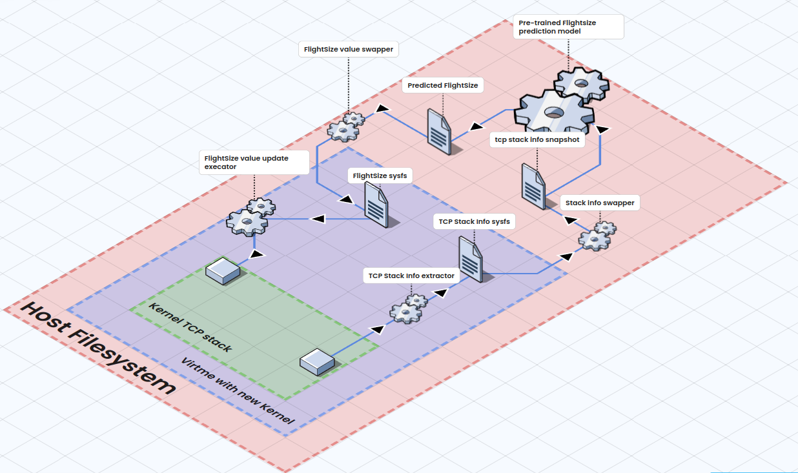

# FlightSize_Learn

This repository contains the source code and experiment scripts for "Towards Accurate TCP FlightSize Estimation: A History-Aware Learning Approach," accepted by the 2025 IEEE International Performance, Computing, and Communications Conference (IPCCC). 
The work implements a machine learning approach to estimate TCP FlightSize from historical data. 

The integration of predicted FlightSize includes: the kernel via our patched kernel, customized kernel modules, user-space ML prediction, and the kernel-user space communication is through sysfs created by the kernel module.
The new compiled kernel is run in Virtme to prevent potential harm to the host system.
The Mahimahi and Mininet network emulation testbeds are used for emulation.


## Overview

The system combines kernel-space TCP monitoring with user-space machine learning to provide accurate TCP flight size estimation. It includes:

- **Kernel Patches**: Patches to support replacing FlightSize with the predicted value. 
- **Kernel Modules**: TCP monitoring and sysfs interface for ML predictions.
- **ML Prediction Engine**: XGBoost-based flight size estimation modeling.
- **Network Testbeds**: Mininet and Mahimahi-based controlled testing environments. Mahimahi with trace replay is used for data collection, and Mininet is used for integration testing.
- **Experiment Automation**: Parameter sweep and batch testing capabilities.

## Architecture



### Core Components

- **`kmod_sysfs/`**: Kernel modules for TCP monitoring and ML interface
- **`C_ml_model/`**: Compiled XGBoost model for real-time prediction
- **`Mininet_testbed/`**: Network simulation framework
- **Experiment control scripts**: Automated parameter testing

### Data Flow

As in architecture.

## Installation

### Prerequisites

```bash
sudo apt install build-essential python3 python3-pip
pip3 install numpy pandas matplotlib psutil xgboost scikit-learn
```

### Setup

1. **Clone repositories**:
   ```bash
   git clone https://github.com/zmrui/FlightSize_Learn FlightSize
   cd FlightSize
   git clone --branch v6.14.9 git://git.kernel.org/pub/scm/linux/kernel/git/stable/linux.git
   git clone https://github.com/amluto/virtme.git
   ```

2. **Build kernel** (branch 6.14.9):
   ```bash
   cp kernel_related/0001-patch-to-support-ML-FlightSize.patch linux/
   cp kernel_related/.config linux/ 
   cd linux
   git apply 0001-patch-to-support-ML-FlightSize.patch
   make KBUILD_BUILD_TIMESTAMP="" bzImage
   cd -
   ```


3. **Build kernel modules**:
   ```bash
   cd kmod_sysfs
   make
   
   cd tcp_monitor
   make
   cd ../..
   ```

## Usage

### Data collection

```bash
python3 collection_mahimahi.py
```

### Modeling training

```bash
python3 xgbtrain.py
```

### ML, ablation study, and feature importance

non_sequential_CV.py

### Start

```bash
python3 C_ml_model/xgb2.py
# Run experiments
./boot_kvm_script.sh
```


### Controlling Configurations

Control files configure experiment parameters:
- `cca_control`: Congestion control algorithm
- `reorder_control`: Packet reordering settings
- `bw_control`: Bandwidth configuration
- `rtt_control`: RTT settings
- `ML_control`: ML prediction parameters

## Important Paths

Some paths were static to /home/ubuntu/FlightSize, please replace them accordingly.

- Kernel source: `/home/ubuntu/FlightSize/linux`
- Socket info: `/home/ubuntu/FlightSize/socket_info`
- ML predictions: `/home/ubuntu/FlightSize/ml_flight_size`
- Compiled model: `/home/ubuntu/FlightSize/C_ml_model/libxgb.so`

